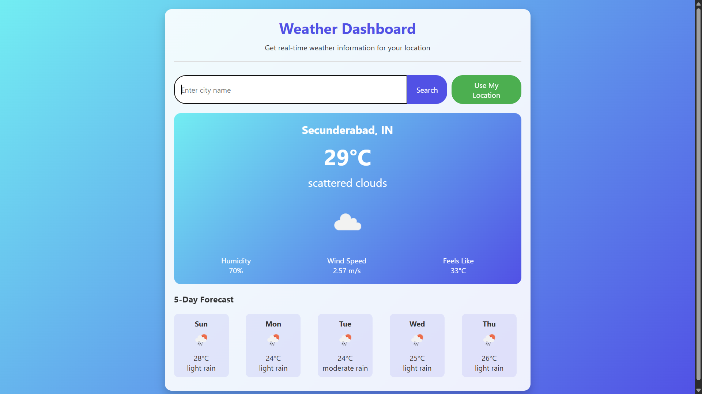

# Weather Dashboard

A responsive web application that provides real-time weather information and a 5-day forecast for any city or your current location, using the OpenWeatherMap API.

## Features

- **Current Weather:** View temperature, weather description, humidity, wind speed, and "feels like" temperature.
- **5-Day Forecast:** See daily forecasts with icons and descriptions.
- **Search by City:** Enter any city name to get weather data.
- **Use My Location:** Get weather for your current location using geolocation.
- **Responsive Design:** Works well on both desktop and mobile devices.
- **Loading & Error Handling:** User-friendly loading indicator and error messages.

## Screenshots

 <!-- Add a screenshot if available -->

## Getting Started

### Prerequisites

- A modern web browser (Chrome, Firefox, Edge, etc.)
- Internet connection

### Installation

1. **Clone or Download the Repository:**
    ```
    git clone https://github.com/baleshwar-regu/weather-dashboard.git
    ```
    Or download the ZIP and extract it.

2. **Open the App:**
    - Open `index.html` in your browser.

### API Key

This project uses the [OpenWeatherMap API](https://openweathermap.org/api). The API key is already included in `script.js` for demonstration purposes. For production use, you should secure your API key.

## File Structure

- `index.html` — Main HTML file.
- `style.css` — Styles for the dashboard.
- `script.js` — JavaScript logic for fetching and displaying weather data.

## Usage

- Enter a city name and click **Search** to view weather data.
- Click **Use My Location** to get weather for your current location.

## Customization

- To use your own OpenWeatherMap API key, replace the value of `API_KEY` in `script.js`.

## License

This project is for educational/demo purposes. Please check the OpenWeatherMap API terms for usage restrictions.

---

**Author:** [baleshwar-regu](https://github.com/baleshwar-regu)